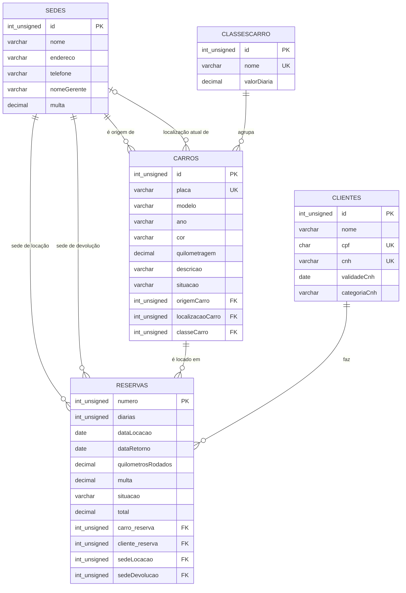

# 🚗 AcdnRentalCar — Banco de Dados de Reserva de Carros

> Projeto da disciplina **Modelagem de Banco de Dados** (UDF — Centro Universitário do Distrito Federal).
> Implementação em **MySQL** do modelo lógico de uma locadora de veículos, usando somente comandos **DDL**.


-orange)


---

## 📑 Sumário

- [Sobre o projeto](#-sobre-o-projeto)
- [Estrutura do repositório](#-estrutura-do-repositório)
- [Modelo entidade-relacionamento](#-modelo-entidade-relacionamento)
- [Dicionário de dados](#-dicionário-de-dados)
- [Relacionamentos (chaves estrangeiras)](#-relacionamentos-chaves-estrangeiras)
- [Erros do artigo que foram corrigidos](#-erros-do-artigo-que-foram-corrigidos)
- [Melhorias em relação ao artigo](#-melhorias-em-relação-ao-artigo)
- [Versão 1 × Versão 2](#-versão-1--versão-2)
- [Como executar](#-como-executar)
- [Testes de integridade](#-testes-de-integridade)
- [Regras de negócio fora do DDL](#-regras-de-negócio-fora-do-ddl)
- [Conceitos praticados](#-conceitos-praticados)
- [Referência](#-referência)
- [Autor](#-autor)

---

## 📌 Sobre o projeto

A **ACDN Rental Car** é uma locadora fictícia com várias **sedes**. Cada sede tem uma frota de **carros**, agrupados em **classes** (Subcompacto, Compacto, Tamanho Médio, Tamanho Grande e Luxo), e o preço da diária depende da classe. **Clientes** com CNH válida fazem **reservas**: retiram o carro numa sede e podem devolvê-lo em outra, pagando uma multa.

O trabalho foi baseado no artigo *"Modelando um Sistema de Reserva de Carros"* (**SQL Magazine nº 74**). O objetivo era transformar o modelo lógico do artigo em um script DDL que rode de verdade. Ao executar o código original, encontrei **3 erros** que impediam a criação do banco. Eles estão documentados e corrigidos abaixo.

**Números do banco:** 1 database · 5 tabelas · 7 chaves estrangeiras · 4 restrições `UNIQUE` · 3 restrições `CHECK`.

---

## 📁 Estrutura do repositório

```
.
├── README.md                     ← esta documentação
├── sql/
│   ├── reserva_carros_ddl.sql    ← versão 1 (completa): script final do trabalho
│   └── reserva_carros_ddl2.sql   ← versão 2 (simplificada): só tabelas, PKs e FKs
└── exemplos/
    ├── dados_exemplo.sql         ← INSERTs para popular o banco (sedes, classes, clientes, carros, reservas)
    └── consultas.sql             ← SELECTs com JOIN, agregações e testes de restrições
```

> A pasta `exemplos/` não fazia parte da entrega (que pedia só DDL). Eu a adicionei depois para provar que o modelo funciona com dados reais.

---

## 🧩 Modelo entidade-relacionamento

O diagrama abaixo é gerado pelo próprio GitHub a partir do código Mermaid.



---

## 📖 Dicionário de dados

Referente à **versão 1** (`sql/reserva_carros_ddl.sql`).

### `sedes`
| Coluna | Tipo | Nulo | Descrição |
|---|---|---|---|
| `id` | `INT UNSIGNED` | não | **PK**, `AUTO_INCREMENT` |
| `nome` | `VARCHAR(50)` | não | Nome da sede |
| `endereco` | `VARCHAR(80)` | não | Endereço |
| `telefone` | `VARCHAR(20)` | não | Telefone de contato |
| `nomeGerente` | `VARCHAR(50)` | não | Gerente responsável |
| `multa` | `DECIMAL(10,2)` | não | Multa cobrada quando um carro desta sede é devolvido em outra |

### `classesCarro`
| Coluna | Tipo | Nulo | Descrição |
|---|---|---|---|
| `id` | `INT UNSIGNED` | não | **PK**, `AUTO_INCREMENT` |
| `nome` | `VARCHAR(20)` | não | Classe (Subcompacto, Compacto…), **UNIQUE** |
| `valorDiaria` | `DECIMAL(10,2)` | não | Preço da diária para a classe |

### `clientes`
| Coluna | Tipo | Nulo | Descrição |
|---|---|---|---|
| `id` | `INT UNSIGNED` | não | **PK**, `AUTO_INCREMENT` |
| `nome` | `VARCHAR(50)` | não | Nome completo |
| `cpf` | `CHAR(11)` | não | CPF, só números, **UNIQUE** |
| `cnh` | `VARCHAR(20)` | não | Número da CNH, **UNIQUE** |
| `validadeCnh` | `DATE` | não | Validade da CNH |
| `categoriaCnh` | `VARCHAR(3)` | não | Categoria (B, AB…) |

### `carros`
| Coluna | Tipo | Nulo | Descrição |
|---|---|---|---|
| `id` | `INT UNSIGNED` | não | **PK**, `AUTO_INCREMENT` |
| `placa` | `VARCHAR(10)` | não | Placa, **UNIQUE** |
| `modelo` | `VARCHAR(40)` | não | Modelo do veículo |
| `ano` | `VARCHAR(9)` | não | Ano no formato `'2023/2024'` (fabricação/modelo) |
| `cor` | `VARCHAR(20)` | não | Cor |
| `quilometragem` | `DECIMAL(10,2)` | não | Km atual |
| `descricao` | `VARCHAR(100)` | não | Itens/observações |
| `situacao` | `VARCHAR(30)` | não | **CHECK**: `disponivel`, `alugado`, `fora do ponto de origem` |
| `origemCarro` | `INT UNSIGNED` | não | **FK → sedes**: sede de origem |
| `localizacaoCarro` | `INT UNSIGNED` | **sim** | **FK → sedes**: onde o carro está agora (`NULL` enquanto alugado) |
| `classeCarro` | `INT UNSIGNED` | não | **FK → classesCarro** |

### `reservas`
| Coluna | Tipo | Nulo | Descrição |
|---|---|---|---|
| `numero` | `INT UNSIGNED` | não | **PK**, `AUTO_INCREMENT` |
| `diarias` | `INT UNSIGNED` | não | Quantidade de diárias, **CHECK** `> 0` |
| `dataLocacao` | `DATE` | não | Data de retirada |
| `dataRetorno` | `DATE` | sim | Preenchida na devolução |
| `quilometrosRodados` | `DECIMAL(10,2)` | sim | Preenchido na devolução |
| `multa` | `DECIMAL(10,2)` | sim | Multa por devolução em outra sede |
| `situacao` | `VARCHAR(15)` | não | **CHECK**: `ativa`, `atrasada`, `finalizada` |
| `total` | `DECIMAL(10,2)` | sim | `diarias × valorDiaria + multa` |
| `carro_reserva` | `INT UNSIGNED` | não | **FK → carros** |
| `cliente_reserva` | `INT UNSIGNED` | não | **FK → clientes** |
| `sedeLocacao` | `INT UNSIGNED` | não | **FK → sedes**: onde retirou |
| `sedeDevolucao` | `INT UNSIGNED` | não | **FK → sedes**: onde vai devolver |

---

## 🔗 Relacionamentos (chaves estrangeiras)

Todas as relações são **1 para muitos**, então a FK fica sempre no lado "muitos" e não foi preciso criar tabela associativa.

| # | Constraint | De | Para | Multiplicidade | Significado |
|---|---|---|---|---|---|
| 1 | `fk_sedesOrigem` | `carros.origemCarro` | `sedes.id` | 1 — 0..* | Sede de origem do carro |
| 2 | `fk_sedesLocAtual` | `carros.localizacaoCarro` | `sedes.id` | 0..1 — 0..* | Sede onde o carro está agora |
| 3 | `fk_classes` | `carros.classeCarro` | `classesCarro.id` | 1 — 0..* | Classe do carro |
| 4 | `fk_sedesLocacao` | `reservas.sedeLocacao` | `sedes.id` | 1 — 0..* | Sede de retirada |
| 5 | `fk_sedesDevolucao` | `reservas.sedeDevolucao` | `sedes.id` | 1 — 0..* | Sede de devolução |
| 6 | `fk_carros` | `reservas.carro_reserva` | `carros.id` | 1 — 0..* | Carro reservado |
| 7 | `fk_clientes` | `reservas.cliente_reserva` | `clientes.id` | 1 — 0..* | Cliente que reservou |

**Por que `reservas` tem duas FKs para `sedes`?** Porque são informações diferentes: onde o carro foi **retirado** e onde será **devolvido**. Quando as duas são diferentes, aplica-se a multa.

**Por que as FKs são criadas com `ALTER TABLE` no final?** Foi a estratégia do artigo. Se a FK estivesse dentro do `CREATE TABLE`, a tabela referenciada precisaria existir antes, e a ordem de criação passaria a importar. Com `ALTER TABLE` depois de todas as tabelas, a ordem deixa de ser um problema.

---

## 🐞 Erros do artigo que foram corrigidos

O código da Listagem 3 do artigo **não executa**. Estes foram os erros encontrados ao rodar no MySQL:

| # | Código original | Erro do MySQL | Correção |
|---|---|---|---|
| 1 | `endereco varchar(80) unsigned` | **1064**: erro de sintaxe. `UNSIGNED` só existe para tipos numéricos. | `endereco VARCHAR(80)` |
| 2 | `sedes.id` é `int unsigned`, mas `carros.origemCarro` é `int` | **150 / 3780**: a FK precisa ter **exatamente o mesmo tipo** da PK. | Todas as FKs passaram a ser `INT UNSIGNED` |
| 3 | `REFERENCES cliente (id)` | **1824**: a tabela `cliente` não existe (o nome correto é `clientes`). | `REFERENCES clientes (id)` |

---

## ✨ Melhorias em relação ao artigo

Todas seguem o **modelo lógico** do próprio artigo (Figura 2 / Tabela 2):

- **`cpf` em `clientes`**: está no modelo lógico, mas tinha ficado de fora da Listagem 3.
- **`localizacaoCarro` aceita `NULL`**: no modelo a multiplicidade é `0..1`. Enquanto o carro está alugado, ele não está em nenhuma sede.
- **`DECIMAL(10,2)` em vez de `FLOAT`**: `FLOAT` é aproximado (`49.99` pode virar `49.9999`), o que é inaceitável para dinheiro. `DECIMAL` é exato.
- **`UNIQUE`** em placa, CPF, CNH e nome da classe: impede duplicidades.
- **`CHECK`** na situação do carro, na situação da reserva e em `diarias > 0`: o banco só aceita os valores previstos no modelo.
- **`DROP DATABASE IF EXISTS`** no início: o script pode ser executado várias vezes sem erro.
- **`utf8mb4`** e **`ENGINE=InnoDB`** explícitos: acentuação correta e suporte garantido a chaves estrangeiras.
- **Constraints com nome** (`fk_`, `uq_`, `ck_`): mensagens de erro mais claras e mais fácil de remover/alterar depois.

---

## 🔄 Versão 1 × Versão 2

O repositório traz duas versões do mesmo modelo:

| | `reserva_carros_ddl.sql` (v1) | `reserva_carros_ddl2.sql` (v2) |
|---|---|---|
| Database | `AcdnRentalCar` | `concessionaria` |
| Objetivo | Script final, com todas as melhorias | Versão enxuta: só tabelas, PKs e FKs |
| `DROP ... IF EXISTS` | ✅ | ❌ (falha se o banco já existir) |
| `cpf` em clientes | ✅ | ❌ |
| `UNIQUE` / `CHECK` | ✅ | ❌ |
| Nomes nas constraints | ✅ | ❌ (o MySQL gera nomes automáticos) |
| `localizacaoCarro` | `NULL` (0..1) | `NOT NULL` |
| Precisão monetária | `DECIMAL(10,2)` | `DECIMAL(8,2)` |

> **Atenção na v2:** os tamanhos de `ano` (`VARCHAR(40)`) e `cor` (`VARCHAR(9)`) ficaram trocados em relação à v1. Uma cor como `"Azul Marinho"` (12 caracteres) não cabe. A v1 é a versão recomendada.

As duas versões foram testadas e executam sem erros.

---

## ▶️ Como executar

### Pré-requisitos
- **MySQL 8.0.16+** (necessário para o `CHECK` ser aplicado) ou **MariaDB 10.2+**
- Um cliente: **MySQL Workbench**, **DBeaver** ou o terminal `mysql`

### Pelo terminal

```bash
# 1. Cria o banco e as tabelas
mysql -u root -p < sql/reserva_carros_ddl.sql

# 2. (opcional) Popula com dados de exemplo
mysql -u root -p < exemplos/dados_exemplo.sql

# 3. (opcional) Roda as consultas de verificação
mysql -u root -p -t < exemplos/consultas.sql
```

### Pelo MySQL Workbench
1. `File → Open SQL Script…` → abra `sql/reserva_carros_ddl.sql`
2. Clique no ⚡ (*Execute*)
3. Repita com `exemplos/dados_exemplo.sql` e `exemplos/consultas.sql`

### Conferindo o resultado
```sql
USE AcdnRentalCar;
SHOW TABLES;          -- 5 tabelas
DESCRIBE reservas;    -- colunas, tipos e chaves
```

Saída esperada da consulta de reservas (`exemplos/consultas.sql`, item 4):

```
+--------+------------+----------------+-----------------+-----------------+---------+--------+--------+------------+
| numero | cliente    | modelo         | retirada        | devolucao       | diarias | multa  | total  | situacao   |
+--------+------------+----------------+-----------------+-----------------+---------+--------+--------+------------+
|      1 | Ana Souza  | Toyota Corolla | Sede Taguatinga | Sede Taguatinga |       3 |   0.00 | 479.70 | finalizada |
|      2 | Bruno Lima | Jeep Commander | Sede Taguatinga | Sede Aeroporto  |       2 | 120.00 | 559.80 | finalizada |
|      3 | Bruno Lima | Chevrolet Onix | Sede Asa Norte  | Sede Asa Norte  |       5 |   NULL |   NULL | ativa      |
+--------+------------+----------------+-----------------+-----------------+---------+--------+--------+------------+
```

---

## 🛡️ Testes de integridade

No final de `exemplos/consultas.sql` há comandos **propositalmente inválidos**. Todos são recusados pelo banco:

| Teste | Restrição que bloqueia | Erro |
|---|---|---|
| Reserva para o cliente `99`, que não existe | `fk_clientes` | `1452 Cannot add or update a child row` |
| Segundo carro com a placa `JKL1A23` | `uq_carros_placa` | `1062 Duplicate entry` |
| Carro com situação `'quebrado'` | `ck_carros_situacao` | `3819` (MySQL) / `4025` (MariaDB) |
| Reserva com `0` diárias | `ck_reservas_diarias` | `3819` (MySQL) / `4025` (MariaDB) |

---

## 📋 Regras de negócio fora do DDL

Como o próprio artigo aponta, algumas regras **não dá para garantir só com `CREATE TABLE`**, porque dependem de outras linhas ou da data atual:

- Cliente com locação em aberto não pode fazer outra reserva.
- Cliente com CNH vencida não pode alugar (a consulta 6 em `consultas.sql` lista esses clientes).
- O `total` deve ser calculado como `diarias × valorDiaria + multa`.

Essas regras ficariam na **aplicação** ou em **triggers / stored procedures**, que não faziam parte do escopo deste trabalho e são uma boa evolução futura.

---

## 🎓 Conceitos praticados

- **DDL** (*Data Definition Language*): `CREATE DATABASE`, `CREATE TABLE`, `ALTER TABLE`, `DROP DATABASE`
- **DML** (*Data Manipulation Language*), nos exemplos: `INSERT`, `UPDATE`, `SELECT`
- Chave primária, `AUTO_INCREMENT` e chave estrangeira
- Restrições `NOT NULL`, `UNIQUE` e `CHECK`
- Multiplicidade (`1`, `0..1`, `0..*`) e mapeamento de relacionamentos 1:N
- Escolha de tipos de dados (`DECIMAL` × `FLOAT`, `CHAR` × `VARCHAR`, `UNSIGNED`)
- Consultas com `JOIN`, `LEFT JOIN`, `GROUP BY` e `COALESCE`

---

## 📚 Referência

- *Modelando um Sistema de Reserva de Carros*, **SQL Magazine**, edição 74. DevMedia.
- [Documentação MySQL 8.0: CREATE TABLE](https://dev.mysql.com/doc/refman/8.0/en/create-table.html)
- [Documentação MySQL 8.0: FOREIGN KEY Constraints](https://dev.mysql.com/doc/refman/8.0/en/create-table-foreign-keys.html)
- [Documentação MySQL 8.0: CHECK Constraints](https://dev.mysql.com/doc/refman/8.0/en/create-table-check-constraints.html)

---

## 👤 Autor

**Daniel Souza**
Estudante na **UDF — Centro Universitário do Distrito Federal**
Disciplina: Modelagem de Banco de Dados · 2026

> Projeto acadêmico. Sinta-se à vontade para estudar e se inspirar; se for usar como base, cite a fonte. 🙂
